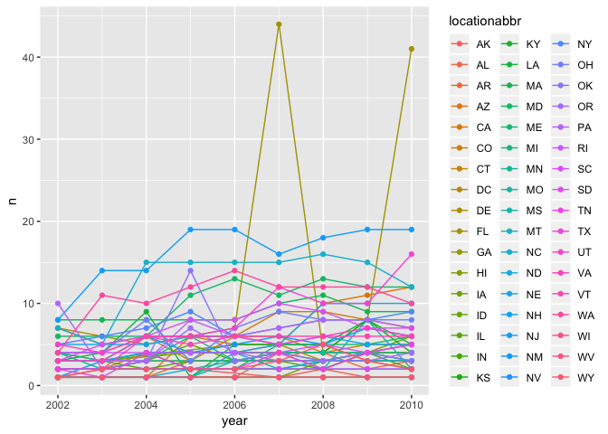
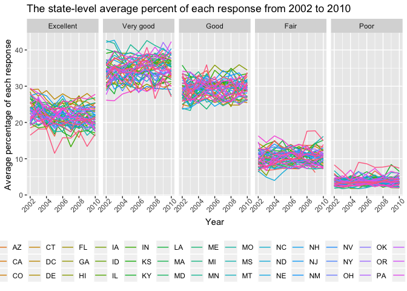
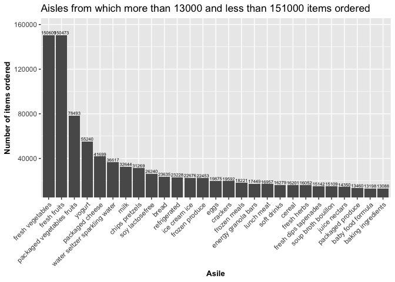
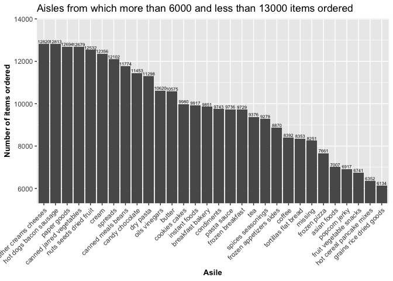
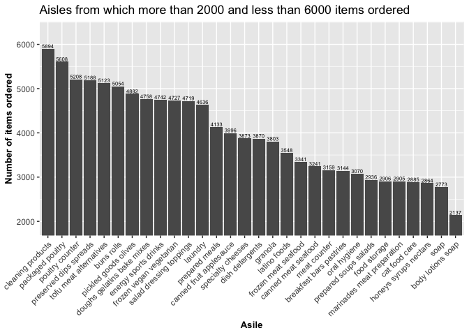
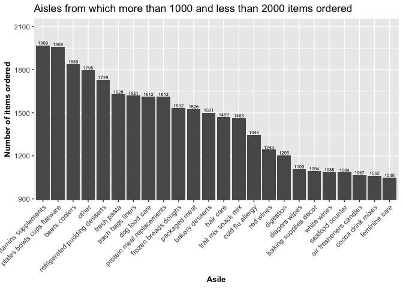
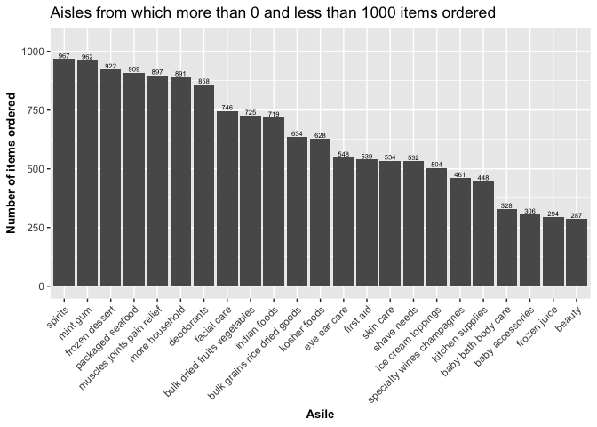

P8105\_hw3\_zf2211
================
Francis
10/10/2018

``` r
library(tidyverse)
```

    ## ── Attaching packages ─────────────────────────────────────────────────────────────────────── tidyverse 1.2.1 ──

    ## ✔ ggplot2 3.0.0     ✔ purrr   0.2.5
    ## ✔ tibble  1.4.2     ✔ dplyr   0.7.6
    ## ✔ tidyr   0.8.1     ✔ stringr 1.3.1
    ## ✔ readr   1.1.1     ✔ forcats 0.3.0

    ## ── Conflicts ────────────────────────────────────────────────────────────────────────── tidyverse_conflicts() ──
    ## ✖ dplyr::filter() masks stats::filter()
    ## ✖ dplyr::lag()    masks stats::lag()

Problem 1
=========

``` r
#read data
library(p8105.datasets)
data(brfss_smart2010, package = "p8105.datasets")
```

``` r
#tidy up data
brfss = brfss_smart2010 %>% 
  janitor::clean_names() %>% 
  filter(topic == "Overall Health") %>% 
  filter(response %in% c("Excellent", "Very good", "Good", "Fair", "Poor")) %>% 
  mutate(response = as_factor(response, levels = c("Excellent", "Very good", "Good", "Fair", "Poor"), ordered = TRUE))
```

In 2002, states

``` r
brfss %>% 
  filter(year == "2002") %>% 
  distinct(locationabbr, locationdesc) %>% 
  count(locationabbr) %>% 
  filter(n == 7)
```

    ## # A tibble: 3 x 2
    ##   locationabbr     n
    ##   <chr>        <int>
    ## 1 CT               7
    ## 2 FL               7
    ## 3 NC               7

were observed at 7 locations.

``` r
#create a dataset for spaghetti plot
brfss1 = brfss %>% 
  group_by(locationabbr, year) %>% 
  distinct(locationdesc) %>% 
  count(locationabbr)
```

``` r
#spaghetti plot
ggplot(brfss1, aes(x = year, y = n, color = locationabbr)) +
  geom_line() +
  geom_point()
```

 This spaghetti plot shows the number of locations change in each state from 2002 to 2010. As we can see, most states have the similar trend and the change is relatively small, while FL had big fluctuation in 2007 and 2010.

``` r
#filter data
brfss %>% 
  filter(year %in% c("2002", "2006", "2010")) %>% 
  filter(locationabbr == "NY", response == "Excellent") %>% 
  group_by(year) %>% 
  summarize(mean = mean(data_value), 
            sd = sd(data_value)) %>% 
#make a table  
  knitr::kable(digits = 1)
```

|  year|  mean|   sd|
|-----:|-----:|----:|
|  2002|  24.0|  4.5|
|  2006|  22.5|  4.0|
|  2010|  22.7|  3.6|

From the table, the mean of NY "Excellent" response decreased from 24.0%(2002) to 22.5%(2006) and keeps similar to 22.7%(2010). The SD of NY "Excellent" response decreased from 4.5%(2002) to 4.0%(2006) to 3.6%(2010).

``` r
#filter data
brfss_avg = brfss %>% 
  group_by(year, locationabbr, response) %>% 
  summarize(avg_prop = mean(data_value))
#plot histogram
ggplot(brfss_avg, aes(x = year, y = avg_prop, color = locationabbr)) +
  geom_line() +
  labs(x = "Year",
       y = "Average percentage of each response",
       title = "The state-level average percent of each response from 2002 to 2010") +
  facet_grid(. ~ response) + #seperate into 5 groups
  theme(legend.position = "bottom",
        axis.text.x = element_text(angle = 45, hjust = 0.8)) +
  guides(colour = guide_legend(nrow = 3)) #row of legend
```

    ## Warning: Removed 1 rows containing missing values (geom_path).

 As we can see, the percent of each response from high to low is "Very good", "Good", "Excellent", "Fair" and "Poor". But we could check this conclusion later if have spare time.

Problem2
========

``` r
#read data and print
data(instacart, package = "p8105.datasets")
print(instacart)
```

    ## # A tibble: 1,384,617 x 15
    ##    order_id product_id add_to_cart_ord… reordered user_id eval_set
    ##       <int>      <int>            <int>     <int>   <int> <chr>   
    ##  1        1      49302                1         1  112108 train   
    ##  2        1      11109                2         1  112108 train   
    ##  3        1      10246                3         0  112108 train   
    ##  4        1      49683                4         0  112108 train   
    ##  5        1      43633                5         1  112108 train   
    ##  6        1      13176                6         0  112108 train   
    ##  7        1      47209                7         0  112108 train   
    ##  8        1      22035                8         1  112108 train   
    ##  9       36      39612                1         0   79431 train   
    ## 10       36      19660                2         1   79431 train   
    ## # ... with 1,384,607 more rows, and 9 more variables: order_number <int>,
    ## #   order_dow <int>, order_hour_of_day <int>,
    ## #   days_since_prior_order <int>, product_name <chr>, aisle_id <int>,
    ## #   department_id <int>, aisle <chr>, department <chr>

``` r
#summary
summary(instacart)
```

    ##     order_id         product_id    add_to_cart_order   reordered     
    ##  Min.   :      1   Min.   :    1   Min.   : 1.000    Min.   :0.0000  
    ##  1st Qu.: 843370   1st Qu.:13380   1st Qu.: 3.000    1st Qu.:0.0000  
    ##  Median :1701880   Median :25298   Median : 7.000    Median :1.0000  
    ##  Mean   :1706298   Mean   :25556   Mean   : 8.758    Mean   :0.5986  
    ##  3rd Qu.:2568023   3rd Qu.:37940   3rd Qu.:12.000    3rd Qu.:1.0000  
    ##  Max.   :3421070   Max.   :49688   Max.   :80.000    Max.   :1.0000  
    ##     user_id         eval_set          order_number      order_dow    
    ##  Min.   :     1   Length:1384617     Min.   :  4.00   Min.   :0.000  
    ##  1st Qu.: 51732   Class :character   1st Qu.:  6.00   1st Qu.:1.000  
    ##  Median :102933   Mode  :character   Median : 11.00   Median :3.000  
    ##  Mean   :103113                      Mean   : 17.09   Mean   :2.701  
    ##  3rd Qu.:154959                      3rd Qu.: 21.00   3rd Qu.:5.000  
    ##  Max.   :206209                      Max.   :100.00   Max.   :6.000  
    ##  order_hour_of_day days_since_prior_order product_name      
    ##  Min.   : 0.00     Min.   : 0.00          Length:1384617    
    ##  1st Qu.:10.00     1st Qu.: 7.00          Class :character  
    ##  Median :14.00     Median :15.00          Mode  :character  
    ##  Mean   :13.58     Mean   :17.07                            
    ##  3rd Qu.:17.00     3rd Qu.:30.00                            
    ##  Max.   :23.00     Max.   :30.00                            
    ##     aisle_id     department_id      aisle            department       
    ##  Min.   :  1.0   Min.   : 1.00   Length:1384617     Length:1384617    
    ##  1st Qu.: 31.0   1st Qu.: 4.00   Class :character   Class :character  
    ##  Median : 83.0   Median : 8.00   Mode  :character   Mode  :character  
    ##  Mean   : 71.3   Mean   : 9.84                                        
    ##  3rd Qu.:107.0   3rd Qu.:16.00                                        
    ##  Max.   :134.0   Max.   :21.00

Instacart dataset contains 1384617 observations and 15 variables, showing numeric variables like order ID, order hours; and character value like product name and department. For example, the order\_id = 1 which ordered by user\_id = 112108, have 8 product which add\_to\_cart\_order is product\_id 49302, 11109, 10246, 49683, 43633, 13176, 47209, 22035. Among them, add\_to\_cart\_order 1,2,5,8 are reordered. instacart$user\_id = 112108 ordered 4 each product on Thursday at 10 p.m. after 9 days of last order. The aisle\_id, aisle, department\_id, department of each product are shown too.

There are

``` r
instacart %>% 
  distinct(aisle) %>% 
  nrow()
```

    ## [1] 134

aisles.

``` r
# number of items from each aisle
aisle_num <- 
instacart %>% 
  group_by(aisle) %>% 
  count() %>% 
  arrange(desc(n))
aisle_num
```

    ## # A tibble: 134 x 2
    ## # Groups:   aisle [134]
    ##    aisle                              n
    ##    <chr>                          <int>
    ##  1 fresh vegetables              150609
    ##  2 fresh fruits                  150473
    ##  3 packaged vegetables fruits     78493
    ##  4 yogurt                         55240
    ##  5 packaged cheese                41699
    ##  6 water seltzer sparkling water  36617
    ##  7 milk                           32644
    ##  8 chips pretzels                 31269
    ##  9 soy lactosefree                26240
    ## 10 bread                          23635
    ## # ... with 124 more rows

`fresh vegetables` and `fresh fruits` are the aisle where most item ordered from.

``` r
#plot aisle
plot_aisle <- function(left, right){
  ggplot(filter(aisle_num, n >= left & n < right), aes(x = reorder(aisle, -n), y = n)) +
  geom_bar(stat = "identity") + 
  geom_text(aes(label = n), size = 2, position = position_dodge(width = 0.9), vjust = -0.25) +
  scale_y_continuous(name = "Number of items ordered") +
  scale_x_discrete(name = "Asile" ) +
  coord_cartesian(ylim = c(left * 0.95, right * 1.05)) +
  labs(title = paste("Aisles from which more than", left, "and less than", right, "items ordered")) +
  theme(axis.text.x = element_text(angle = 45, hjust = 1),
       axis.title = element_text(size = 10, face = "bold")
)
}
plot1 = plot_aisle (0, 1000)
plot2 = plot_aisle (1000, 2000)
plot3 = plot_aisle (2000, 6000)
plot4 = plot_aisle (6000, 13000)
plot5 = plot_aisle (13000, 151000)
plot5  
```



``` r
plot4  
```



``` r
plot3  
```



``` r
plot2 
```



``` r
plot1 
```

 I divided the 134 aisles into 5 groups(0-1000, 1000-2000, 2000-6000, 6000-13000, 13000-151000), and plot each group a barchart in a descending way. Fresh vegetables and fresh fruits are outstanding high while other aisles are in a relatively smoothly descending way.

The most popular items in each aisle is:

``` r
# make a table showing the most popular item in aisles "baking ingredients", "dog food care", "packaged vegetables fruits"
instacart %>% 
  filter(aisle %in% c("baking ingredients", "dog food care", "packaged vegetables fruits")) %>% 
  group_by(aisle) %>% 
  count(product_name) %>% 
  mutate(item_ranking = min_rank(desc(n))) %>% 
  filter(item_ranking == 1) %>% 
  select(-item_ranking) %>% 
  knitr::kable()
```

| aisle                         | product\_name                                    |                                  n|
|:------------------------------|:-------------------------------------------------|----------------------------------:|
| baking ingredients            | Light Brown Sugar                                |                                499|
| dog food care                 | Snack Sticks Chicken & Rice Recipe Dog Treats    |                                 30|
| packaged vegetables fruits    | Organic Baby Spinach                             |                               9784|
| "Light Brown Sugar", "Snack S | ticks Chicken & Rice Recipe Dog Treats", and "Or |  ganic Baby Spinach" respectively.|

Since aisle "package vegetables fruits" is much bigger than "dog food care", there are a lot more "Organic Baby Spinach" order than "Snack Stick Chichen & Rice Recipe Dog Treats" order in each aisle correspondingly.

``` r
# filter product_name and make adjustments to date/time variables accordingly.
instacart %>% 
  filter(product_name %in%  c("Pink Lady Apples","Coffee Ice Cream")) %>% 
  group_by(product_name, order_dow) %>% 
  summarize(mean_hr = mean(order_hour_of_day)) %>% 
  mutate(mean_hr = paste(floor(mean_hr), round((mean_hr - floor(mean_hr)) * 60), sep=":")) %>% 
  spread(key = order_dow, value = mean_hr) %>% 
  rename('Sun' = '0', 'Mon'= '1', 'Tue' = '2', 'Wed' = '3', 'Thu' = '4', 'Fri' = '5', 'Sat' = '6') %>%
  knitr::kable() 
```

| product\_name       | Sun     | Mon     | Tue     | Wed      | Thu      | Fri      | Sat                                                                                                                                                                                                                                                             |
|:--------------------|:--------|:--------|:--------|:---------|:---------|:---------|:----------------------------------------------------------------------------------------------------------------------------------------------------------------------------------------------------------------------------------------------------------------|
| Coffee Ice Cream    | 13:46   | 14:19   | 15:23   | 15:19    | 15:13    | 12:16    | 13:50                                                                                                                                                                                                                                                           |
| Pink Lady Apples    | 13:26   | 11:22   | 11:42   | 14:15    | 11:33    | 12:47    | 11:56                                                                                                                                                                                                                                                           |
| The table lists the | average | hour of | day whe | n Pink L | ady Appl | es and C | offee Ice Cream are ordered. We can say the two items are almost ordered evenly in the day, because the mean of the time are between 11:30 and 15:00. The Coffee Ice Cream is ordered more in the afternoon since its mean time is later than Pink Lady Apples. |

Problem3
========

``` r
#read data
data(ny_noaa, package = "p8105.datasets")
ny_noaa
```

    ## # A tibble: 2,595,176 x 7
    ##    id          date        prcp  snow  snwd tmax  tmin 
    ##    <chr>       <date>     <int> <int> <int> <chr> <chr>
    ##  1 US1NYAB0001 2007-11-01    NA    NA    NA <NA>  <NA> 
    ##  2 US1NYAB0001 2007-11-02    NA    NA    NA <NA>  <NA> 
    ##  3 US1NYAB0001 2007-11-03    NA    NA    NA <NA>  <NA> 
    ##  4 US1NYAB0001 2007-11-04    NA    NA    NA <NA>  <NA> 
    ##  5 US1NYAB0001 2007-11-05    NA    NA    NA <NA>  <NA> 
    ##  6 US1NYAB0001 2007-11-06    NA    NA    NA <NA>  <NA> 
    ##  7 US1NYAB0001 2007-11-07    NA    NA    NA <NA>  <NA> 
    ##  8 US1NYAB0001 2007-11-08    NA    NA    NA <NA>  <NA> 
    ##  9 US1NYAB0001 2007-11-09    NA    NA    NA <NA>  <NA> 
    ## 10 US1NYAB0001 2007-11-10    NA    NA    NA <NA>  <NA> 
    ## # ... with 2,595,166 more rows

The `ny_noaa` dataset contains 2595176 records and 7 variables relevant to 'national-wise daily weather data. The records are reported from 747 distinct stations, from 1981-01-01 to 2010-12-31. Precipitation (in tenths of mm), snowfall (in mm), snow depth (in mm) and maximun / minimum temperature (in tenths of degree C) are the variables included in this dataset.
Out of the total 2595176 records, there are 0 % missing values in the variable `tmax_dC` and `tmin_dC`; 15% in `snow_mm`; 23% in `snwd_mm`.
The relatively large proportion of missing values may reduce reliability of statistics generated based on this dataset. Limited number of observations on tmax/tmin during earlier years, due to the large quantity of their missing values, may render the samples in this dataset being less representative of the overall weather pattern in NY.

``` r
#summarize data
summarize(ny_noaa)
```

    ## data frame with 0 columns and 0 rows
